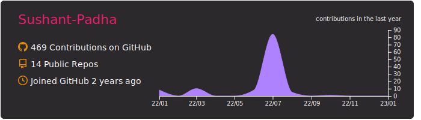

# Hi, I'm Sushant!


```python
#!/usr/bin/python3
# -*- coding: utf8 -*-

class Me(Person):
    def __init__(self):
        self.name = "Sushant-Padha"
        self.age = 15
        self.country = "India"
        self.motivation = "Hobby"
        self.best = {
            "language": "Python",
            "indent": "tabs",
            "paradigm": "OOP"
        }

    def get_goal(self):
        return [
            "Keep learning.",
            "Contributing to open source."
        ]
```

### My Blog 📄 (coming soon)


### Languages & Tools 🛠

&nbsp;
&nbsp;
&nbsp;
&nbsp;

&nbsp;
&nbsp;
&nbsp;

&nbsp;
&nbsp;

### Learning 📖

&nbsp;
&nbsp;
![Assembly][assembly-badge]&nbsp;

### Interests 👨‍💻

- Optimization problems
- Quantum Computing
- Machine Learning
- Algorithmic programming and problem solving in general...

### Projects 📔

- [TimetableSolver.jl](https://github.com/Sushant-Padha/TimetableSolver.jl): Julia package to create a timetable schedule, using [ConstraintSolver.jl](https://github.com/Wikunia/ConstraintSolver.jl) and [JuMP](https://github.com/jump-dev/JuMP.jl).

- [tictactoe](https://github.com/Sushant-Padha/tictactoe): Simple console-based tictactoe game written in Python.

- [vignere-cipher](https://github.com/Sushant-Padha/vignere-cipher): Basic implementation of a [Vigenère Cipher](https://en.wikipedia.org/wiki/Vigen%C3%A8re_cipher) in Python.

### Analytics ⚙️

<a href="https://github.com/Sushant-Padha">




<!--  -->

<!--  -->
</a>

### Links 🤝

[](https://stackoverflow.com/users/15083607/sushant-padha)
[](mailto:sushant.padha@gmail.com)
[](mailto:sushant.padha@gmail.com)

---

*Forked from [GuillaumeFalourd/GuillaumeFalourd](https://github.com/GuillaumeFalourd/GuillaumeFalourd)*

<!--it was too long bcz of custom base64 image data-->
[assembly-badge]: https://img.shields.io/badge/-Assembly-05122A?style=flat&logo=data:image/png;base64,iVBORw0KGgoAAAANSUhEUgAAACAAAAAgCAYAAABzenr0AAAACXBIWXMAAAFSAAABUwDqB+DaAAAH60lEQVR4nLVXCVSU1xW+zMI2/yy4sSsYTURcSMQgq4DsyDI4LIKI7KCgbAoDak41YnSUMZBgT0UUBxEUV1xKorGGUCLxNDa1xApBURQNaLQVU8H29r3/B6Ip5Eii75x75s3/33e/+993V4ARFuOsCGIO99wwmOvlriNfmSo+ePs7g8mzpjHppWrp7r9dGWM62VhSeKbOQFVfb2A80VD8h79eFmf+vlQ6yXoKU93ZJg7LymDeWeCkf7Tnhsw9ImwknBEXL0m1BT5HNI5QKnm5mn3wGaKpZ0wkb0djM6/+GU4PWuanp+m4L9x/69E0+yAf3sl/I6gbLxt7LA2nvGNzKw8ZRCqzqQzDBNUO3mjAdQjppag2w3nEiVH5edp5mj3wKaKlb+xibXVDI//MU7RRxPuJKtq7dDU3um1cQnz4J3pRS93w1STf2HDKOyGv8sD46IIsKsMsaet23ZcBFhCSmluGi2fZfaq7Yvv3UI8oStjQpZ1X8QOc6kNx6KqbAtW5XjjyAGXypOv83S39vL3XnkkD4q7DoW7kF134UaxI6wBiDZ2Cqod6se/doTL00nd0S2fY1slMzDx/UQGZuWWMwMEf4V0fBIcABHk6wjzy31mOELwCYa4XgnsEQkAywhwPBJ8YBN9Ybr8wCWFBJMcTtBzBZRGCnS+RkYbgGMjKFDj694tMzBYMC65NzW7jeJkFf9ebE2QzH2GGC4K1E4KVPbef7sjtZ9K9A0d0b+XAvaM89D09Q5/buHKyqEwim5lue0LwPLDYa0kYJBdtEi4v3iZM3fYY5vkRRnLgnQXIuARh2gcluPPg8VFTac0xjH1PhYJ5vpyFqBJOwShIK76nRfB4yepNEocAb+Cf6Uf4EyJ1Fjjdx5mSaC1zlWPzNy34W9eJ842cEtSakUqEswNYDYjiypvfgcg+yNdYkZ1tHpVfoBu34SF7b8SMBSW7h4T84/pNTNmkRq8VeeiTpvxFojyJG4uwpe360Pmo/ELuOogv6Ma932kSmpNjFLo6W2Lj7gR6kfk5/ILqvbrrD+0X5u7tZR2GMB8++/kQ+DgPBblfcqezXF+OCC+14JXWdlaGam8N5x9uYcjPr7ovIHjCtTV7JAvjl4Hw5JM+LRK38Amhul4E/wTiQI549FwDeziJfA0LzjrRKIicWbpuCytjW8VBhLfsECJyEer/iyweSVayfa0tYDBtjrVFcKRiakR8tCh05X2w9WS/4sg5zgIeqWsQZruOXoHZbugUn/mTAjOc2SjQD13ZbhmyJNQiOEohNZ9iCfq5+/YwO5ubJDsvNQtUZ/vANZS9gkEFPJfn/moFnBOzflKAhqnPMhTsaOhlSpubRDsvNY1PURWCzv6O23DqKdLsBTX3WCYaw69cgWnzEBSZCMcecVhnnqG05GIDGJhPMTUOWORuEbYkQBQY303j//kreGUK0ARl64F6gQnXTIJCPUwXhiyQjjMaB8LiL5uYqm+7mOqrd3llV/4DnkvY+3r1FrBnUzS/orWfqWrp0q++1jVm/eEa0C9q+AL2375L6J7WLqKAR9TrUyAwBaGirR8qO+/Cga67zLraKhBbTDcX+cZ5j5WnyvWCErthzuu9Ap3A5FbGL95H4hvrLTY0Hw/C6jtd/JM/Iv/kE4SD33PV7XU5YWgWah37JwrqniCPlABZyaVGYHLKy3glFxuFH138kr/lk6cwX/H6wtA7BnlFFx7zi5saeR81NzJJWzeCZKbjbC15ZrR++Jok3bCsB680ESX8LBHZ+aAwfPV1vjxzqUCeEc28MXMq6NT19rMViqZHYhrwT3whFae8r/7VqXjZ+uFS8QAWqYjSirZvQRKhzBAoa8p01x2qEK4u/79i1HrjFk7wJNnRanTFaIxbCP59oCIOFSOSZfnKyh6hsrpMmF+zS+qfvBTGuIUHGiaqCkxS1Ru0Ezc/GizHyuKyoXLa2tHJNiY+K5ToS0quX1r+sETfUZ7lhR/i1faOofORyk1D5Vg7WXXbKHHrWoopmuvlCjqDDclnLzYkkvnB+OfLV/C3LnqVfHL3wzUkUtqQyNwWhxiG5RaYRa/bqJO0+V/Pt2Qi50DWB3ZoDhOqHfh9OVLvq8XotR9w4M+1ZKTd7zKJyFtrGKEsEM/19XhhFhC97fj1sE0pdUIax4NN6bSBBpWGFiW6p8+sBppSykv5ft6UEmUY67nHBTDCklhOjeI5LMShtnzRKgR70pa7hCCEpHNCaOsdmMp9FU1afvFshmPTrGcUB0bbeZpPqDWpDOrYNATt/fpERqbuI84FWlQJUwsFM9PutE76h100ZPQTNnUKlJoeON2PorDMdv6284+1jv6AEnlKK6/8KhlM2p4xAYmtUNuDPHVDr75iZTst79prDzzQi/vdLXYwWfXxXZG17VF9IzP3lxrRqIm0k7cVsmPV4vw1/FxNOXWeid6xEQJ1wxcCMprNCInz0SejmQ4ZzaydQrzoaAZFDV+Zei8LpbzjcjVVY5fkZ1AZJkkqlfbLAD+/+HQ4vcAOp/m8NRoNnCPKeMZE8dSNzfz6frSmw+m+jvva+28+siLDqVYdN5waecQMDKcaOpzmDA6n/NEqIHVVBEqOP2yX2nq5ShXpyUztvTbxG7PflGSUbmfKr34jM7E0km45dVy89dwfZRNMJ8jKvv6LJGPXx+JJVpMlNXeujVFkr5K97eIgOfKg3cAtQjESzv8An0gFqtm/KNsAAAAASUVORK5CYII=
